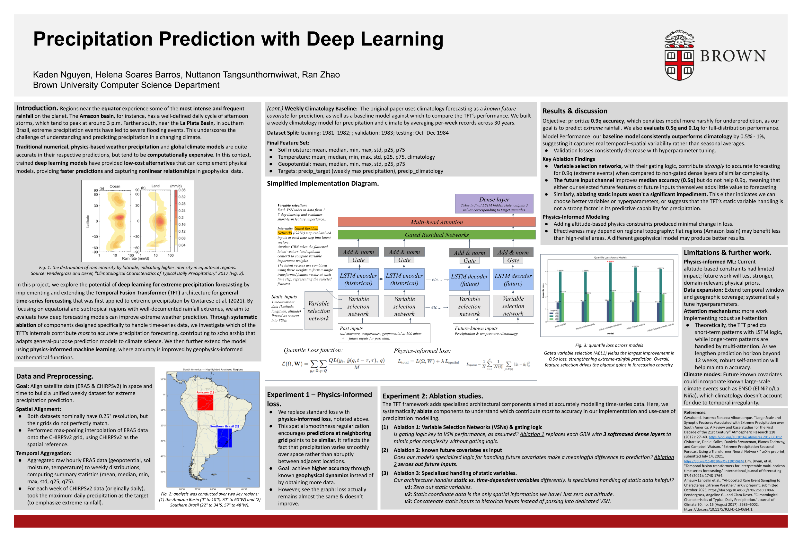

# precipitation-forecast-transformer

Welcome! We're team [weatherboy](https://www.youtube.com/watch?v=XOi2jFIhZhA)! :) In this project, we use a transformer architecture with additional time-series forecasting logic to predict extreme precipitation. Please see the poster below for an overview, theoretical grounding, and the experiments we make upon the two technical papers we draw from ([1](https://arxiv.org/abs/1912.09363), [2](https://s3.us-east-1.amazonaws.com/climate-change-ai/papers/icml2021/44/paper.pdf)) as novel inquiry.

Follow [this link](https://docs.google.com/presentation/d/1mPv58csaJgK0WDBEiXfnSQoYmqqemDju/edit?usp=sharing&ouid=105983754986807589279&rtpof=true&sd=true) to find it in text form. 

